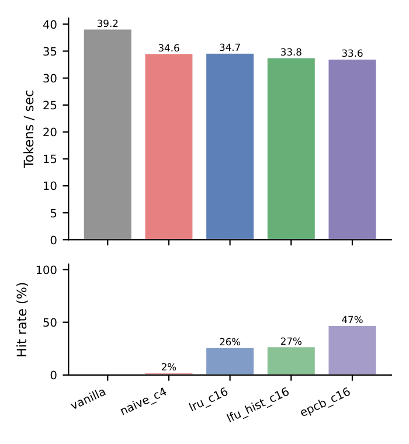
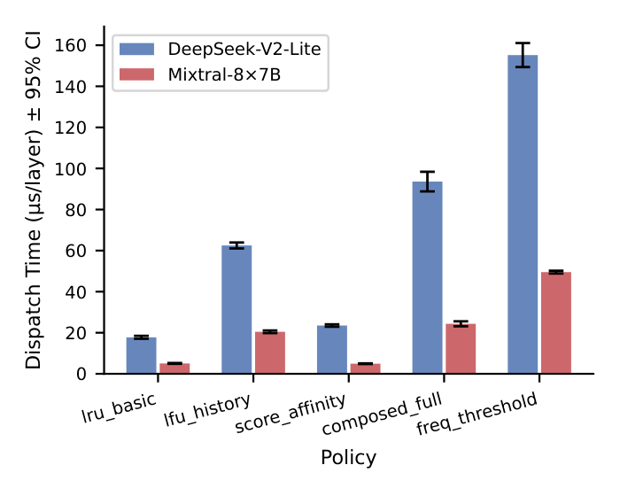
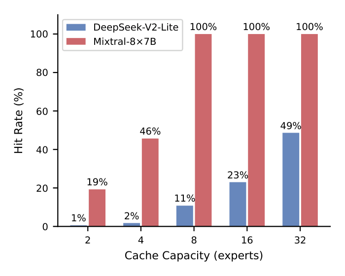
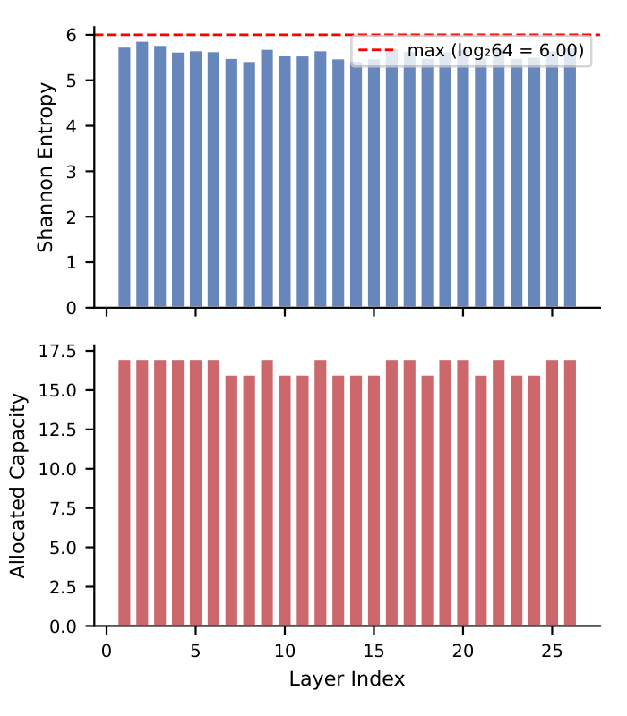
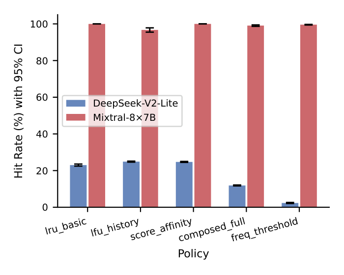

# MoE-Sched

**A scheduling language for Mixture-of-Experts models.**

> Author: **Jesse Pokora** &middot; License: [MIT](LICENSE)

---

## What Is This?

Large language models like Mixtral, DeepSeek, and Qwen use **Mixture-of-Experts (MoE)** — instead of one giant network, they have dozens of smaller "expert" networks and a router that picks which ones to use for each token. By design, only a fraction of experts are active at any time, so the rest are **offloaded** to CPU memory — this is intentional, not a limitation.

But managing that offloading is complex. *Which* experts to keep on GPU? *When* to prefetch the next ones? *How* to evict under memory pressure?

**Every existing system hardcodes these decisions** in hundreds of lines of C++/CUDA. MoE-Sched replaces all of that with a small, declarative language.

<p align="center">
  
</p>

---

## The Language

A MoE-Sched policy is a `.moe` file with four composable blocks:

```
policy balanced {
    cache {
        capacity = 16
        eviction = lfu
        frequency_decay = 0.9
    }
    prefetch {
        strategy = history
        budget = 4
    }
    schedule { mode = hybrid }
    adapt {
        when hit_rate < 0.4 for 100 accesses
            { eviction = lru }
    }
}
```

| Block | Controls | Options |
|-------|----------|---------|
| **cache** | Which experts stay on GPU | LRU, LFU, score-based, frequency-threshold |
| **prefetch** | Proactive loading | History, affinity, lookahead |
| **schedule** | Where to run cache misses | GPU-only, CPU-fallback, hybrid |
| **adapt** | Runtime self-tuning | Conditional rules that hot-swap components |

**Switching from LRU to LFU?** Change one word. **Adding prefetching?** Two lines.

---

## Two Lines to Attach

```python
import moe_sched
from transformers import AutoModelForCausalLM

model = AutoModelForCausalLM.from_pretrained("allenai/OLMoE-1B-7B-0924")

# Auto-generate a tuned policy from your model + GPU, attach it
mgr = moe_sched.auto_attach(model)
output = model.generate(...)
print(mgr.get_stats())  # hit rate, transfers, evictions
```

Or write a policy explicitly:

```python
mgr = moe_sched.attach(model, """
    policy aggressive {
        cache { capacity = 8  eviction = lru }
    }
""")
```

Or load a `.moe` file:

```python
mgr = moe_sched.attach(model, open("my_policy.moe").read())
```

---

## Why a Language?

Python dicts could configure this. The DSL adds three things they can't:

1. **Static validation** — 17 semantic rules catch bad policies at parse time, not mid-inference
2. **Portability** — `.moe` files are shareable, diffable, and tool-agnostic
3. **Constraint** — you can't write arbitrary code in a scheduling policy; the grammar limits you to what makes sense

---

## Results

### The abstraction is effectively free

<p align="center">
  
</p>

All policies add **< 3.2% overhead** on A100 (6–47 µs/layer vs. 1,459 µs for MoE forward pass).

### 13–36× less code than published systems

| System | Their LOC | MoE-Sched | Reduction |
|--------|-----------|-----------|-----------|
| ExpertFlow | ~400 (Py+CUDA) | 16 lines | 25× |
| HybriMoE | ~500 (Py+CUDA) | 14 lines | 36× |
| Fiddler | ~250 (Py+C++) | 7 lines | 36× |
| MoE-Infinity | ~200 (Python) | 16 lines | 13× |
| vLLM | ~260 (Py+C++) | 12 lines | 22× |

### Policy selection produces measurable differences

<p align="center">
  
</p>

Different policies → different real performance. Mixtral saturates quickly (8 experts); DeepSeek (64 experts) needs smarter strategies.

### EPCB: Smart allocation beats raw capacity

Not all layers are equal — some concentrate on a few experts, others spread across many. **Entropy-Proportional Cache Budgeting** allocates more cache to high-entropy layers:

<p align="center">
  
</p>

| Strategy | Hit Rate |
|----------|----------|
| Uniform cap=32 | 48.6% |
| **EPCB (same memory)** | **64.5%** |

+15.9 percentage points from smarter allocation — no extra memory.

### Live inference on consumer GPU

OLMoE-1B-7B on RTX 5080 Laptop (16 GB VRAM):

<p align="center">
  
</p>

| Policy | Cap | Hit Rate | tok/s |
|--------|-----|----------|-------|
| Vanilla (no hooks) | — | — | 39.2 |
| Naive LRU | 4 | 2.4% | 34.6 |
| LRU | 16 | 26.3% | 34.7 |
| LFU+History | 16 | 27.1% | 33.8 |
| **EPCB** | **16** | **47.3%** | 33.6 |

---

## Installation

```bash
pip install -e ".[gpu]"
```

Minimal (DSL only, no GPU):
```bash
pip install -e .
```

Optional Cython fast path (< 10 µs/layer):
```bash
pip install -e ".[cython]"
python setup_cython.py build_ext --inplace
```

---

## Supported Models

| Model | Experts × Layers | Routing | Tested on |
|-------|-----------------|---------|-----------|
| Mixtral-8×7B-Instruct | 8 × 32 | top-2 | A100-80 GB |
| DeepSeek-V2-Lite | 64 × 27 | top-6 | A100-80 GB |
| OLMoE-1B-7B | 64 × 16 | top-8 | RTX 5080 (16 GB) |

---

## Project Structure

```
moe_sched/
├── grammar.lark           # Lark LALR grammar (62 productions)
├── parser.py              # Grammar → PolicyIR
├── ir.py                  # Intermediate representation
├── validator.py           # 17 semantic validation rules
├── compiler.py            # IR → CompiledPolicy
├── auto.py                # Auto-generate policies from model + GPU
├── dsl.py                 # Python eDSL (@sched.policy decorator)
├── adaptive.py            # Adaptive policies (adapt blocks)
├── autotuner.py           # Grid-search policy optimizer
├── cli.py                 # CLI: validate, compile, run
├── runtime/
│   ├── hooks.py           # 5-step per-layer dispatch protocol
│   ├── cache.py           # LRU / LFU / Score / FreqThreshold
│   ├── prefetch.py        # Affinity / History / Lookahead
│   ├── scheduler.py       # GPU-only / CPU-fallback / Hybrid
│   ├── per_layer.py       # EPCB — entropy-proportional caching
│   ├── triggers.py        # Memory-pressure & TTL eviction
│   └── _fast/             # Cython-accelerated paths
└── integrations/
    ├── __init__.py         # attach() — main user API
    ├── huggingface.py      # HuggingFace Transformers hooks
    └── weight_placement.py # Expert offloading manager
```

---

## Running Experiments

```bash
# Offline trace replay (no GPU needed)
python scripts/run_eval.py
python scripts/run_sweep.py

# Live inference on consumer GPU
python scripts/run_dsl_demo.py
python scripts/run_constrained_e2e.py

# Generate all paper figures
python scripts/generate_figures.py
```

---

## Tests

```bash
python -m pytest tests/ -q
```

362 tests covering parsing, validation, compilation, runtime dispatch,
adaptive policies, and integration hooks.

---

## Documentation

See [`docs/MANUAL.md`](docs/MANUAL.md) for the full language reference,
runtime API, and policy authoring guide.

---

## Citation

```bibtex
@article{pokora2026moesched,
  title={MoE-Sched: A Domain-Specific Language for Mixture-of-Experts Scheduling Policies},
  author={Pokora, Jesse},
  year={2026}
}
```

---

## License

[MIT License](LICENSE) — Copyright (c) 2026 Jesse Pokora
